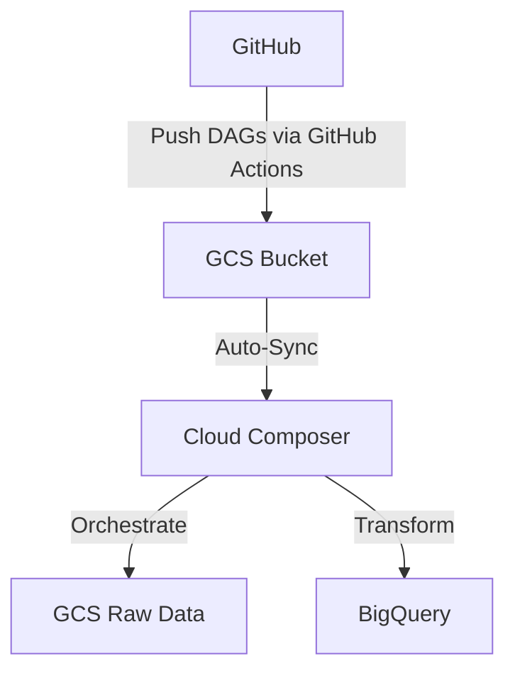

### **Professional Documentation: GitHub + GCP (Cloud Composer, GCS) + Airflow Integration**  
**Version**: 1.1  
**Last Updated**: [Date]  

---

## **Overview**  
This guide outlines a workflow to automate data pipeline orchestration using **GitHub**, **GCP Cloud Composer** (managed Airflow), and **GCP Cloud Storage (GCS)**. The pipeline ingests NVIDIA stock data via `yfinance`, processes it in BigQuery, and provides full auditability.  

---

## **Tools & Roles**  

| **Tool**                | **Purpose**                                                                 |
|-------------------------|-----------------------------------------------------------------------------|
| **GitHub**              | Version control for Airflow DAGs (Python scripts).                          |
| **GitHub Actions**      | Automatically deploys DAGs to GCS on code changes.                          |
| **GCP Cloud Composer**  | Managed Airflow environment to orchestrate workflows.                       |
| **GCP Cloud Storage**   | Stores raw data (CSV files) and Airflow DAGs.                               |
| **BigQuery**            | Processes and transforms raw stock data.                                   |
| **Python**              | Defines Airflow DAGs and data ingestion logic using `yfinance`.             |

---

## **Architecture**  


---

## **Setup Guide**  

### **1. Prerequisites**  
- **GCP Project** with billing enabled.  
- **GitHub Repository** for Airflow DAGs (e.g., `airflow-dags`).  
- Basic familiarity with GCP, Airflow, and Python.  

---

### **2. GCP Configuration**  

#### **Step 1: Create a Cloud Composer Environment**  
1. **Create Composer Environment**:  
   ```bash
   gcloud composer environments create stock-data-env \
       --location=us-central1 \
       --image-version=composer-2.4.3-airflow-2.6.3
   ```
2. **Note the GCS Bucket**:  
   - Composer creates a default bucket (e.g., `us-central1-stock-data-env-bucket`).  
   - DAGs are stored in the `dags/` subfolder.  

#### **Step 2: Create a Raw Data GCS Bucket**  
```bash
gsutil mb -p your-project gs://nvidia-stock-raw-data
```

#### **Step 3: Configure Service Accounts**  
1. **GitHub Actions Service Account**:  
   ```bash
   gcloud iam service-accounts create github-actions-sa \
       --display-name="GitHub Actions Deployer"
   gcloud projects add-iam-policy-binding your-project \
       --member=serviceAccount:github-actions-sa@your-project.iam.gserviceaccount.com \
       --role=roles/storage.objectAdmin
   ```
2. **Composer Service Account**:  
   - Ensure the default service account has:  
     - **BigQuery Data Editor**  
     - **Storage Object Admin**  

---

### **3. GitHub Configuration**  

#### **Step 1: Store Secrets in GitHub**  
In your GitHub repository:  
1. Navigate to **Settings > Secrets > Actions**.  
2. Add secrets:  
   - `GCP_PROJECT_ID`: Your GCP project ID (e.g., `stock-data-project`).  
   - `GCS_BUCKET`: Composer’s DAG bucket (e.g., `us-central1-stock-data-env-bucket`).  
   - `GCP_SA_KEY`: Contents of the GitHub Actions service account JSON key.  

#### **Step 2: GitHub Actions Workflow**  
Create `.github/workflows/deploy-dags.yml`:  
```yaml
name: Deploy DAGs to GCP
on:
  push:
    branches: [ "main" ]
jobs:
  deploy:
    runs-on: ubuntu-latest
    permissions:
      contents: read
    steps:
      - name: Checkout Code
        uses: actions/checkout@v4

      - name: Authenticate to GCP
        uses: google-github-actions/auth@v1
        with:
          credentials_json: ${{ secrets.GCP_SA_KEY }}

      - name: Upload DAGs to GCS
        uses: google-github-actions/upload-cloud-storage@v1
        with:
          path: ./dags/
          destination: ${{ secrets.GCS_BUCKET }}/dags/
          parent: false
```

---

### **4. Airflow DAG Implementation**  

#### **Step 1: DAG Code**  
Create `dags/nvidia_stock_pipeline.py`:  
```python
from airflow import DAG
from airflow.operators.python import PythonOperator
from airflow.providers.google.cloud.transfers.gcs_to_bigquery import GCSToBigQueryOperator
from airflow.providers.google.cloud.operators.bigquery import BigQueryExecuteQueryOperator
from airflow.providers.google.cloud.hooks.gcs import GCSHook
from datetime import datetime, timedelta
import yfinance as yf
import pandas as pd

default_args = {
    'owner': 'airflow',
    'start_date': datetime(2024, 1, 1),
    'retries': 2,
    'retry_delay': timedelta(minutes=5)
}

def fetch_stock_data(**kwargs):
    # Fetch 15 years of historical data
    ticker = "NVDA"
    end_date = datetime.now().strftime('%Y-%m-%d')
    start_date = (datetime.now() - timedelta(days=15*365)).strftime('%Y-%m-%d')
    
    data = yf.download(
        tickers=ticker,
        start=start_date,
        end=end_date,
        interval="1d"
    ).reset_index()
    
    # Upload to GCS
    data['Date'] = data['Date'].dt.strftime('%Y-%m-%d')
    csv_data = data.to_csv(index=False)
    
    hook = GCSHook(gcp_conn_id='google_cloud_default')
    hook.upload(
        bucket_name='nvidia-stock-raw-data',
        object_name=f'nvidia_stock/{kwargs["ds"]}_data.csv',
        data=csv_data,
        mime_type='text/csv'
    )

with DAG(
    dag_id='nvidia_stock_pipeline',
    schedule_interval='@daily',
    default_args=default_args,
    catchup=False
) as dag:

    fetch_task = PythonOperator(
        task_id='fetch_nvidia_data',
        python_callable=fetch_stock_data
    )

    load_to_bq = GCSToBigQueryOperator(
        task_id='load_to_bigquery',
        bucket='nvidia-stock-raw-data',
        source_objects=['nvidia_stock/*.csv'],
        destination_project_dataset_table='your_project.stock_data.raw',
        autodetect=True,
        write_disposition='WRITE_APPEND',
        time_partitioning={'type': 'DAY', 'field': 'Date'}
    )

    transform_data = BigQueryExecuteQueryOperator(
        task_id='transform_data',
        sql='''
            CREATE OR REPLACE TABLE your_project.stock_analytics.summary AS
            SELECT 
                Date,
                Close,
                AVG(Close) OVER (ORDER BY Date ROWS 365 PRECEDING) AS moving_avg
            FROM your_project.stock_data.raw
        ''',
        use_legacy_sql=False
    )

    fetch_task >> load_to_bq >> transform_data
```

#### **Step 2: Install Python Dependencies**  
In Cloud Composer:  
1. Navigate to **Admin > PyPI Packages**.  
2. Add:  
   - `yfinance==0.2.31`  
   - `pandas==2.1.4`  

---

### **5. Execution & Monitoring**  

1. **Trigger the Pipeline**:  
   - Push code to GitHub. DAGs auto-deploy to GCS via GitHub Actions.  
   - Airflow will detect the DAG within 3-5 minutes.  
2. **Monitor in Airflow UI**:  
   - Access the Composer Airflow URL.  
   - Check **DAG Runs** and **Task Logs** for errors.  

---

### **6. Validation**  

#### **BigQuery**  
```sql
-- Verify data
SELECT COUNT(*) AS total_records 
FROM `your_project.stock_data.raw`
```
**Expected Result**: ~3,775 rows (15 years of daily data).  

#### **GCS**  
Confirm files exist:  
```bash
gsutil ls gs://nvidia-stock-raw-data/nvidia_stock/
```

---

### **7. Troubleshooting**  

| **Issue**                     | **Resolution**                              |
|-------------------------------|---------------------------------------------|
| DAG not appearing in Airflow  | Check `gs://[COMPOSER_BUCKET]/dags/` in GCS. |
| Permission denied (GCS/BigQuery) | Verify IAM roles for both service accounts. |
| `yfinance` import errors      | Ensure PyPI packages are installed in Composer. |

---

### **8. Cost Optimization**  

| **Resource**          | **Cost-Saving Tips**                          |
|-----------------------|-----------------------------------------------|
| **Cloud Composer**    | Use smaller environment for non-production.   |
| **BigQuery**          | Partition tables by `Date` to reduce scan costs. |
| **GCS**               | Set lifecycle rules to delete old files.      |

---

### **9. Production Recommendations**  

1. **Data Validation**: Integrate Great Expectations for data quality checks.  
2. **Alerting**: Add Slack/Email alerts using Airflow’s `on_failure_callback`.  
3. **Incremental Loading**: Use Airflow’s `execution_date` to avoid reprocessing.  

---

**Revision History**  
- v1.0: Initial release with GitHub Actions integration.  
- v1.1: Added validation steps and cost optimization.  

**Contact**: [Your Team Email]  
**Documentation Owner**: [Your Name]