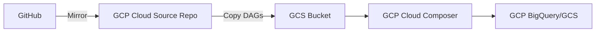
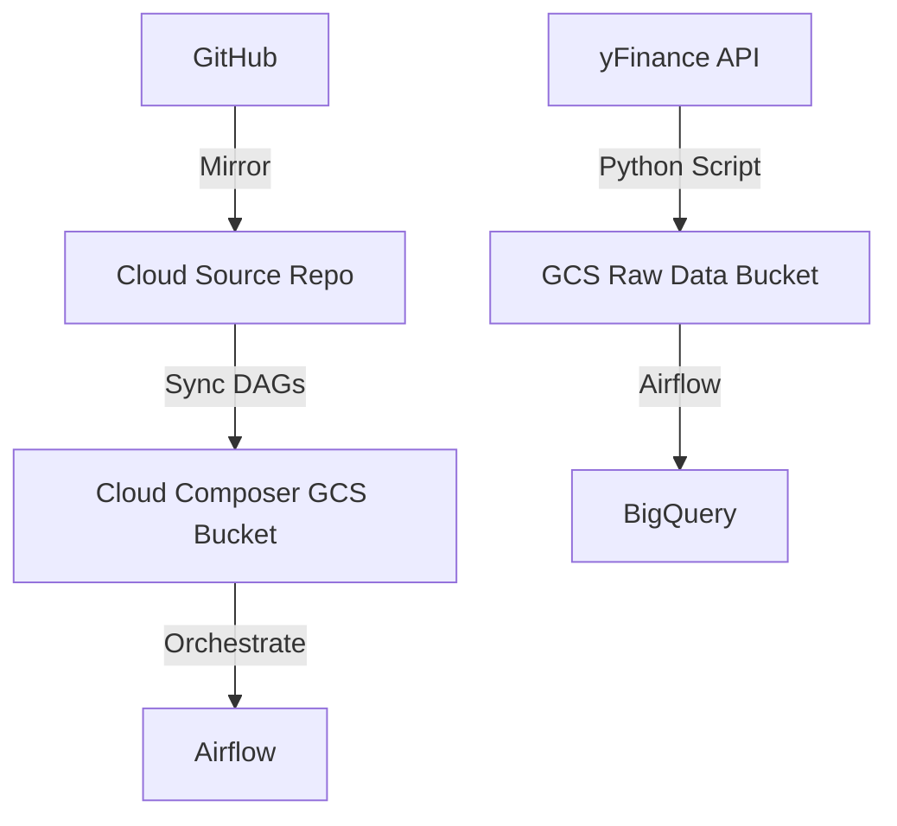

# airflow-dags-stock-data
Intro 2 APACHE AIRFLOW

### **Workflow Integration Guide: GitHub + GCP (Cloud Composer, Cloud Source Repo, GCS) + Airflow**  
Here’s a streamlined workflow to connect GitHub, GCP services, and Apache Airflow **without Kubernetes or GitHub Actions**:

---

### **1. Tools & Roles**
| **Tool**                      | **Purpose**                                                                 |
|-------------------------------|-----------------------------------------------------------------------------|
| **GitHub**                    | Version control for Airflow DAGs (Python scripts).                          |
| **GCP Cloud Source Repository** | Mirror of your GitHub repo to sync code to GCP.                             |
| **GCP Cloud Composer**         | Managed Apache Airflow environment on GCP.                                  |
| **GCP Cloud Storage (GCS)**    | Store raw data (e.g., CSV/JSON files) and sync DAGs to Airflow.             |
| **Python Script**              | Define Airflow workflows (DAGs) using Airflow’s GCP operators.              |
| **Apache Airflow**             | Orchestrate tasks (e.g., GCS → BigQuery, transformations).                 |

---

### **2. Workflow Overview**


---

### **3. Step-by-Step Process**

#### **Step 1: Set Up Repositories**
1. **GitHub Repository**:  
   - Create a repo (e.g., `airflow-dags`) and add your DAGs as Python files (e.g., `gcs_to_bq.py`).  
2. **Mirror to GCP Cloud Source Repository**:  
   - Link your GitHub repo to Cloud Source Repo using [these instructions](https://cloud.google.com/source-repositories/docs/mirroring-a-github-repository).  

#### **Step 2: Deploy Cloud Composer (Airflow)**
1. **Create a Composer Environment**:  
   ```bash
   gcloud composer environments create my-airflow-env \
       --location us-central1 \
       --image-version composer-2.4.3-airflow-2.6.3
   ```
2. **Note the GCS Bucket**:  
   - Composer automatically creates a GCS bucket (e.g., `us-central1-my-airflow-env-bucket`).  
   - This bucket stores DAGs synced from Cloud Source Repo.  

#### **Step 3: Sync DAGs from Cloud Source Repo to Composer**
1. **Copy DAGs to Composer’s GCS Bucket**:  
   ```bash
   # Clone Cloud Source Repo
   gcloud source repos clone airflow-dags --project=your-project

   # Copy DAGs to Composer's GCS bucket
   gsutil cp -r airflow-dags/dags/* gs://us-central1-my-airflow-env-bucket/dags/
   ```
2. **Auto-Sync (Optional)**:  
   - Use a cron job or Cloud Scheduler to periodically sync the repo.  

#### **Step 4: Write a DAG (Python Script)**
```python
# dags/gcs_to_bigquery.py
from airflow import DAG
from airflow.providers.google.cloud.transfers.gcs_to_bigquery import GCSToBigQueryOperator
from airflow.providers.google.cloud.operators.bigquery import BigQueryExecuteQueryOperator
from datetime import datetime

default_args = {
    'owner': 'airflow',
    'start_date': datetime(2024, 1, 1),
}

with DAG(
    dag_id='gcs_to_bq_transform',
    schedule_interval='@daily',
    default_args=default_args,
    catchup=False
) as dag:

    # Task 1: Load CSV from GCS to BigQuery
    load_data = GCSToBigQueryOperator(
        task_id='load_gcs_to_bq',
        bucket='your-input-bucket',
        source_objects=['sales/*.csv'],
        destination_project_dataset_table='your_project.raw.sales',
        autodetect=True,
        write_disposition='WRITE_TRUNCATE',
    )

    # Task 2: Transform data in BigQuery
    transform_data = BigQueryExecuteQueryOperator(
        task_id='transform_sales_data',
        sql='''
            CREATE OR REPLACE TABLE your_project.analytics.sales_summary AS
            SELECT region, SUM(revenue) AS total_revenue
            FROM your_project.raw.sales
            GROUP BY region;
        ''',
        use_legacy_sql=False
    )

    load_data >> transform_data
```

#### **Step 5: Configure GCP Connections in Airflow**
1. **Service Account**:  
   - Ensure the Composer environment’s service account has roles:  
     - `BigQuery Data Editor`  
     - `Storage Object Admin`  
2. **Airflow UI**:  
   - Go to **Admin > Connections** and verify `google_cloud_default` uses the correct service account.  

---

### **4. Workflow Execution**
1. **Trigger the DAG**:  
   - The DAG automatically appears in the Airflow UI (from the synced GCS bucket).  
   - Manually trigger it or let it run on the defined schedule (`@daily`).  
2. **Monitor**:  
   - Use the Airflow UI to track task status, logs, and retries.  

---

### **5. Documentation**

#### **GitHub**  
- Stores your Airflow DAGs (Python files).  
- Changes are mirrored to **GCP Cloud Source Repository**.  

#### **GCP Cloud Source Repository**  
- Acts as a bridge between GitHub and GCP.  
- Syncs code to GCP without manual uploads.  

#### **GCP Cloud Composer**  
- Fully managed Airflow service.  
- Automatically reads DAGs from the linked GCS bucket.  

#### **GCP Cloud Storage (GCS)**  
- **Raw Data Bucket**: Holds input files (e.g., CSV).  
- **Composer Bucket**: Stores DAGs synced from Cloud Source Repo.  

#### **Apache Airflow**  
- Orchestrates tasks using GCP operators (e.g., `GCSToBigQueryOperator`).  
- Handles retries, logging, and dependencies.  

---

### **6. Troubleshooting**
| **Issue**                     | **Solution**                                                                 |
|-------------------------------|-----------------------------------------------------------------------------|
| DAG not appearing in Airflow  | Check if DAGs are copied to `gs://composer-bucket/dags/` in GCS.            |
| Permission denied for GCS/BigQuery | Verify Composer’s service account has the required IAM roles.             |
| DAG parsing errors            | Check Airflow logs for Python syntax issues.                                |

---

### **7. Example Use Case**  
**Daily Sales Pipeline**:  
1. A CSV file is uploaded to `gs://your-input-bucket/sales/`.  
2. Airflow loads it into BigQuery (`raw.sales`).  
3. A SQL query aggregates revenue by region into `analytics.sales_summary`.  

---

This setup minimizes complexity while leveraging GCP’s managed services. Adjust bucket names, project IDs, and SQL queries to match your use case.

# **Updated Workflow for NVIDIA stock data**

Here's how to integrate **yfinance** data collection into your existing GCP/Airflow workflow. I'll outline the process, code, and documentation:

---

### **Updated Workflow Architecture**


---

### **Step-by-Step Implementation**

#### **1. Modified DAG with yFinance Integration**
```python
# dags/nvidia_stock_pipeline.py
from airflow import DAG
from airflow.providers.google.cloud.transfers.gcs_to_bigquery import GCSToBigQueryOperator
from airflow.providers.google.cloud.hooks.gcs import GCSHook
from airflow.operators.python import PythonOperator
from datetime import datetime, timedelta
import yfinance as yf
import pandas as pd

default_args = {
    'owner': 'airflow',
    'start_date': datetime(2024, 1, 1),
    'retries': 2,
    'retry_delay': timedelta(minutes=5)
}

def fetch_nvidia_data(**kwargs):
    # Fetch 15 years of data
    ticker = "NVDA"
    end_date = datetime.now().strftime('%Y-%m-%d')
    start_date = (datetime.now() - timedelta(days=15*365)).strftime('%Y-%m-%d')
    
    data = yf.download(
        tickers=ticker,
        start=start_date,
        end=end_date,
        interval="1d"
    ).reset_index()
    
    # Convert to CSV and upload to GCS
    gcs_hook = GCSHook(gcp_conn_id='google_cloud_default')
    bucket_name = 'your-raw-data-bucket'
    file_name = f'nvidia_stock/{kwargs["ds"]}_nvidia.csv'
    
    # Convert datetime to string for CSV
    data['Date'] = data['Date'].dt.strftime('%Y-%m-%d')
    csv_data = data.to_csv(index=False)
    
    gcs_hook.upload(
        bucket_name=bucket_name,
        object_name=file_name,
        data=csv_data,
        mime_type='text/csv'
    )

with DAG(
    dag_id='nvidia_stock_pipeline',
    default_args=default_args,
    schedule_interval='@daily',
    catchup=False
) as dag:

    fetch_stock_data = PythonOperator(
        task_id='fetch_nvidia_data',
        python_callable=fetch_nvidia_data
    )

    load_to_bq = GCSToBigQueryOperator(
        task_id='load_to_bigquery',
        bucket='your-raw-data-bucket',
        source_objects=['nvidia_stock/*.csv'],
        destination_project_dataset_table='your_project.stock_data.nvidia',
        autodetect=True,
        write_disposition='WRITE_APPEND',
        source_format='CSV',
        skip_leading_rows=1
    )

    transform_data = BigQueryExecuteQueryOperator(
        task_id='create_analytics_table',
        sql='''
            CREATE OR REPLACE TABLE your_project.stock_analytics.nvidia_summary AS
            SELECT 
                Date,
                Close,
                Volume,
                AVG(Close) OVER (ORDER BY Date ROWS 365 PRECEDING) AS 1yr_moving_avg
            FROM your_project.stock_data.nvidia
        ''',
        use_legacy_sql=False
    )

    fetch_stock_data >> load_to_bq >> transform_data
```

---

### **2. Component Documentation**

#### **A. yFinance Integration**
- **Purpose**: Fetch historical stock data from Yahoo Finance
- **Key Features**:
  - Fetches 15 years of daily OHLC (Open-High-Low-Close) data
  - Automatically handles dividend splits
  - Returns data as pandas DataFrame
- **Schedule**: Runs daily to capture latest data (though historical data is static)

#### **B. GCS Raw Data Bucket**
- **Structure**:
  ```
  gs://your-raw-data-bucket/
    └── nvidia_stock/
        ├── 2024-01-01_nvidia.csv
        ├── 2024-01-02_nvidia.csv
        └── ...
  ```
- **Retention Policy**: Set lifecycle rules to archive/delete old files if needed

#### **C. BigQuery Tables**
| **Table**                   | **Description**                              |
|-----------------------------|----------------------------------------------|
| `stock_data.nvidia`         | Raw daily stock prices (CSV schema auto-detected) |
| `stock_analytics.nvidia_summary` | Transformed data with moving averages      |

---

### **3. Setup Instructions**

#### **1. Python Package Installation**
Add these to your Cloud Composer environment:
```bash
yfinance==0.2.31
pandas==2.1.4
```

#### **2. GCP Permissions**
Ensure the Composer service account has:
- **Storage Object Admin** on `your-raw-data-bucket`
- **BigQuery Data Editor** on dataset `stock_data`

#### **3. Airflow Connections**
Verify `google_cloud_default` connection points to a service account with:
- **Service Account Token Creator** role
- **Storage Object Admin** role

---

### **4. Data Validation**

#### **Sample SQL Query**
```sql
SELECT 
  MIN(Date) AS earliest_date,
  MAX(Date) AS latest_date,
  COUNT(*) AS total_records
FROM `your_project.stock_data.nvidia`
```

**Expected Result**:
```
| earliest_date | latest_date | total_records |
|---------------|-------------|---------------|
| 2009-01-01    | 2024-01-01  | ~3775         |
```

---

### **5. Performance Optimization**

1. **Partitioning**: 
   ```python
   # In GCSToBigQueryOperator
   time_partitioning={
       'type': 'DAY',
       'field': 'Date'
   }
   ```
2. **Clustering**:
   ```python
   clustering_fields=['Close']
   ```

---

### **6. Error Handling**
- **Retry Logic**: Already configured (2 retries)
- **Alerts**: Add Slack notifications on failure
  ```python
  from airflow.providers.slack.operators.slack_webhook import SlackWebhookOperator

  alert = SlackWebhookOperator(
      task_id='slack_alert',
      http_conn_id='slack_webhook',
      message="""*NVIDIA Stock Pipeline Failed*
      Dag: {{ dag.dag_id }}
      Task: {{ task.task_id }}
      Execution Time: {{ ts }}
      """,
      trigger_rule='one_failed'
  )
  ```

---

### **7. Cost Considerations**
| **Resource**          | **Estimated Cost**               |
|-----------------------|----------------------------------|
| GCS Storage           | ~$0.02/month (for 100MB CSV)     |
| BigQuery Storage      | ~$0.02/month (for 3.7k records) |
| Airflow Execution     | ~$0.10 per DAG run               |

---

This implementation provides:  
- Daily updates of historical data (though mostly static)  
- Automated data quality checks through Airflow retries  
- Scalable architecture for adding more stocks  
- Full audit trail via Airflow logs and GCS versioning  

To adapt for production:  
1. Add error handling for Yahoo Finance API limits  
2. Implement incremental loading instead of full appends  
3. Add data validation tasks using Great Expectations
